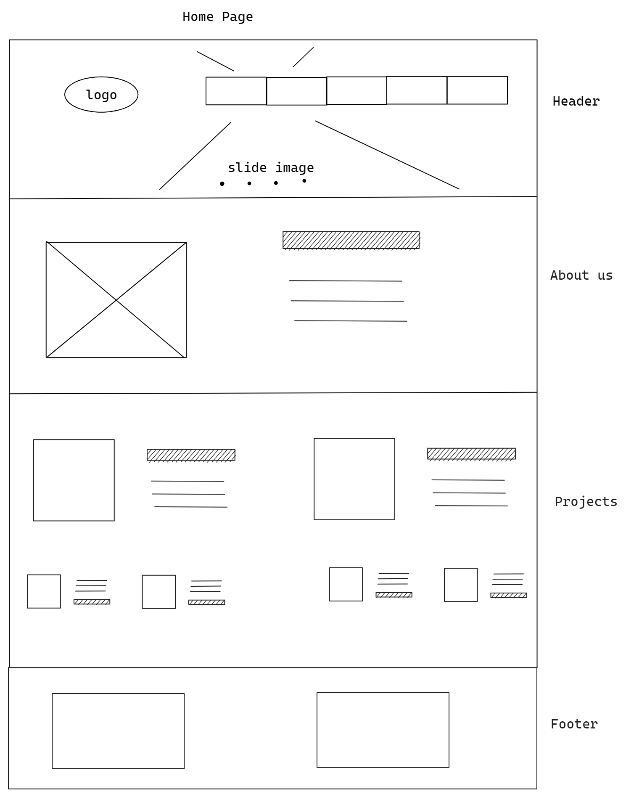
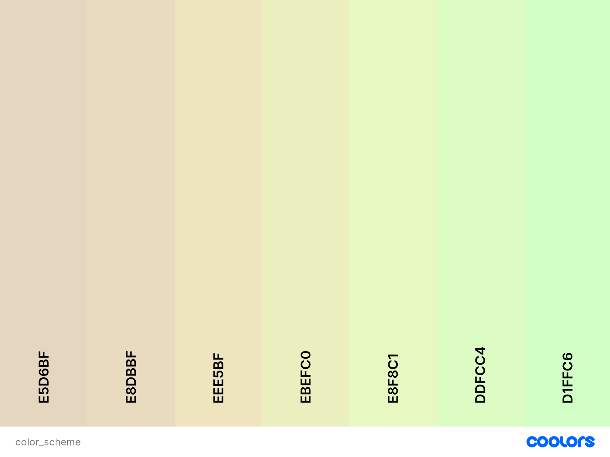

# GiftASeed

by Xiaoxin(Cindy) Cheng
She Codes crowdfunding project - DRF Backend.

## About GiftASeed:

-Welcome to GiftASeed, a crowdfunding platform with a noble mission to nurture our planet's natural wonders and foster a sustainable future. At GiftASeed, we believe that every small act has the potential to create a profound impact on the environment. Our platform serves as a digital garden where individuals, communities, and organizations can come together to support environmental projects focused on conservation, reforestation, and sustainable practices.
-Our vision is to inspire a global community that cares for the Earth and its diverse ecosystems. Through GiftASeed, we empower passionate environmentalists, changemakers, and dreamers to turn their visions into reality. Each project showcased on our platform represents a seed of hope, symbolizing the potential to grow into something extraordinary.
-Whether you're an individual seeking to make a difference, a community determined to protect its natural heritage, or an organization dedicated to environmental causes, GiftASeed provides the perfect space to connect with like-minded individuals and contribute to meaningful projects.
-Join us on this extraordinary journey of giving back to our planet, one seed at a time. Together, we can create a flourishing landscape of positive change and ensure a brighter and greener future for generations to come.

## Features

{{ The features your MVP will include. (Remebber this is a working document, you can change these as you go!) }}

* [] feature1:user can login/logout
* [] feature2:user(owner) can create project
* [] feature3:user(owner) can update/delete his/her own project
* [] feature4:user(supporter) can creat pledge
* [] feature5:admin can delete pledge or comment on pledge
* [] feature6:admin can delete user

### Stretch Goals

{{ Outline three features that will be your stretch goals if you finish your MVP }}

* [] Stretch goal one
* [] Stretch goal two
* [] Stretch goal three

## API Specification

| HTTP Method | Url       | Purpose              | Request Body   | Successful Response Code | Authentication  Authorization |
| ----------- | --------- | -------------------- | -------------- | ------------------------ | ---------------------------------- |
| GET         | projects/ | Return all projects  | N/A            | 200                      | N/A                                |
| POST        | projects/ | Create a new project | project object | 201                      | User must be logged in.            |
| GET         | projects/1/ | Return the project with ID of "1" | N/A | 200                      | N/A            |
| PUT        | projects/1/ | Update the project with ID of "1" | project object | 200                      | Must be logged in. Must be the project owner.|
| DELETE        | projects/1/ | Delete the project with ID of "1" | N/A | 200                      | Must be logged in. Must be the project owner.|
| POST        | pledges/ | Create a new pledge| pledge object | 201                      | Must be logged in. Must not be the project owner.|
| GET        | pledges/1/ | Get the pledge with ID of "1"| N/A | 200                      | N/A |
| DELETE        | pledges/1/ | Delete the pledge with ID of "1" | N/A | 200                      | Must be logged in. Must be the pledge owner.|
## Database Schema

## Wireframes

{{ Insert your wireframes }}

## Colour Scheme

{{ Insert your colour scheme-Neutral }}

## Fonts

{{ outline your heading & body font(s) }}
header fonts:Roboto
body fonts: Roboto

## Submission Documentation

{{ Fill this section out for submission }}

Deployed Project: [Deployed website](http://linkhere.com/)

### How To Run

{{ What steps to take to run this code }}

### Updated Database Schema

{{ Updated schema }}

### Updated Wireframes

{{  Updated wireframes }}

### How To Register a New User

{{ Step by step instructions for how to register a new user and create a new project (i.e. endpoints and body data). }}

### Screenshots

* [] A screenshot of Insomnia, demonstrating a successful GET method for any endpoint.
  
* [] A screenshot of Insomnia, demonstrating a successful POST method for any endpoint.
  
* [] A screenshot of Insomnia, demonstrating a token being returned.
  
