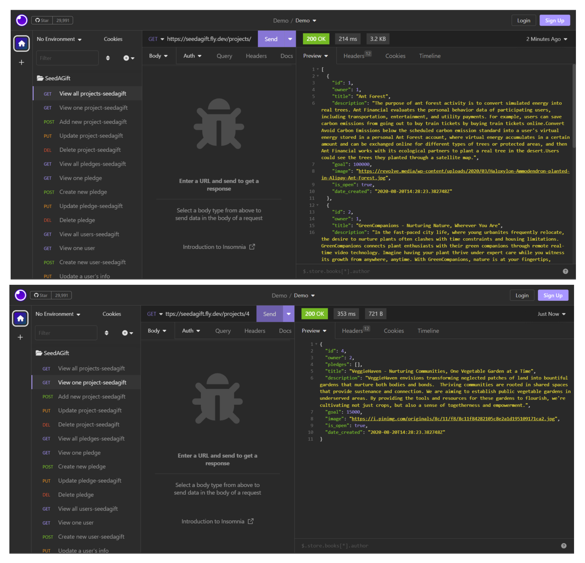
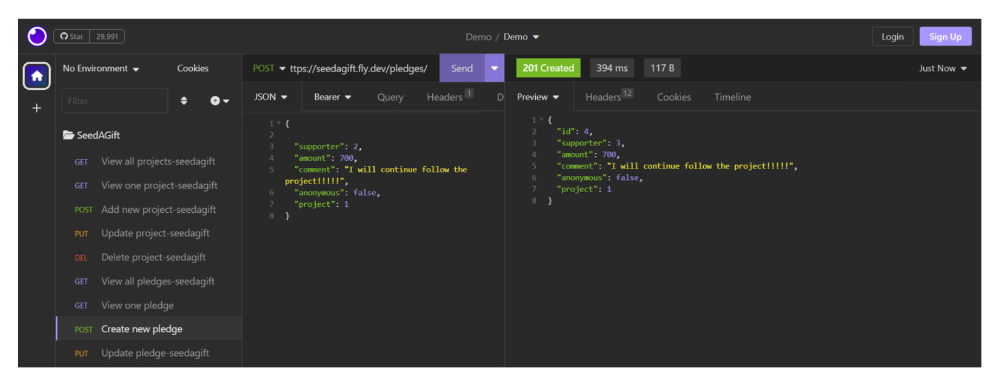
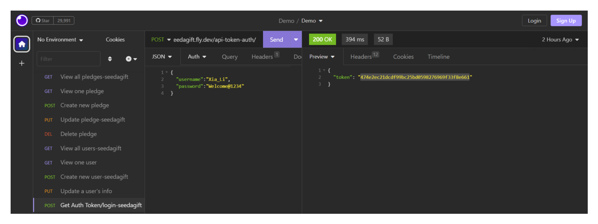

# GiftASeed

by Xiaoxin(Cindy) Cheng
She Codes crowdfunding project - DRF Backend.

## About GiftASeed:

-Welcome to GiftASeed, a crowdfunding platform with a noble mission to nurture our planet's natural wonders and foster a sustainable future. At GiftASeed, we believe that every small act has the potential to create a profound impact on the environment. Our platform serves as a digital garden where individuals, communities, and organizations can come together to support environmental projects focused on conservation, reforestation, and sustainable practices.
-Our vision is to inspire a global community that cares for the Earth and its diverse ecosystems. Through GiftASeed, we empower passionate environmentalists, changemakers, and dreamers to turn their visions into reality. Each project showcased on our platform represents a seed of hope, symbolizing the potential to grow into something extraordinary.
-Whether you're an individual seeking to make a difference, a community determined to protect its natural heritage, or an organization dedicated to environmental causes, GiftASeed provides the perfect space to connect with like-minded individuals and contribute to meaningful projects.
-Join us on this extraordinary journey of giving back to our planet, one seed at a time. Together, we can create a flourishing landscape of positive change and ensure a brighter and greener future for generations to come.

## Features

* [x] feature1:user can login/logout.
* [x] feature2:user(owner) can create new project,user(supporter) can create new pledge.
* [x] feature3:user(owner) can update/delete their own project, user(supporter) can update/delete their own pledge.
* [x] feature4:only admin can update/delete any project and pledge.
* [x] feature5:only admin can view all users.
* [x] feature6:both admin and user themselves can view/update their own user information.

### Stretch Goals

* [x] Stretch goal one: ensure non-admin user can only update their own profile.
* [x] Stretch goal two: for non-admin users, return an empty queryset (hide other users' information).

## API Specification

| HTTP Method | Url       | Purpose              | Request Body   | Successful Response Code | Authentication  Authorization |
| ----------- | --------- | -------------------- | -------------- | ------------------------ | ---------------------------------- |
| GET         | projects/ | Return all projects  | N/A            | 200                      | N/A                                |
| POST        | projects/ | Create a new project | project object | 201                      | User must be logged in.            |
| GET         | projects/1/ | Return the project with ID of "1" | N/A | 200                      | N/A            |
| PUT        | projects/1/ | Update the project with ID of "1" | project object | 200                      | Must be logged in. Must be the project owner or admin.|
| DELETE        | projects/1/ | Delete the project with ID of "1" | N/A | 200                      | Must be logged in. Must be the project owner or admin.|
| GET         | pledges/ | Return all pledges  | N/A            | 200                      | N/A  |
| POST        | pledges/ | Create a new pledge| pledge object | 201                      | Must be logged in. Must not be the project owner.|
| GET        | pledges/1/ | Get the pledge with ID of "1"| N/A | 200                      | N/A |
| PUT        | pledges/1/ | Update the pledge with ID of "1" | pledge object | 200                      | Must be logged in. Must be the pledge owner or admin.|
| DELETE        | pledges/1/ | Delete the pledge with ID of "1" | N/A | 200                      | Must be logged in. Must be the pledge owner or admin.|
| GET         | users/ | Return all users  | N/A            | 200                      | Must be the admin  |
| GET        | users/1/ | Get the user with ID of "1"| N/A | 200                      | Must logged in. |
| PUT        | users/1/ | Update the user with ID of "1" | user object | 200                      | Must be logged in. Must be the user owner or admin.|

## Database Schema

## Wireframes

Main Page Wireframe:

## Colour Scheme

## Fonts

header fonts:Roboto
body fonts: Roboto

## Submission Documentation

Deployed Project: [seedagift](https://seedagift.fly.dev/projects/)

### How To Run

Two users' login details are listed for testing:
-admin_user and project1/2 owner:
  username:admin
  password:Welcome@1234
-non admin_user and prject3/4 owner:
  username:Xiaoxin_Cheng
  password:Welcome@1234

### Updated Database Schema

### Updated Wireframes

Main Page Wireframe:

### How To Register a New User and Create a New Project

Here are step-by-step instructions on how to register a new user and create a new project using the provided endpoints and JSON body data:

Registering a new user: 
-navigate to: [create_new_user](https://seedagift.fly.dev/users/)
-ensure the HTTP Request is set to "POST".
-prepare a JSON body with the user object data.
-once you have the JSON body ready, paste it into the request body section.
-click "send" button or equivlent.

Creating a new project: 
-navigate to: [create_new_project](https://seedagift.fly.dev/projects/)
-ensure the HTTP Request is set to "POST".
-prepare a JSON body with the project object data.
-once you have the JSON body ready, paste it into the request body section.
-click "send" button or equivlent.

### Screenshots

* [x] A screenshot of Insomnia, demonstrating a successful GET method for any endpoint.
  
* [x] A screenshot of Insomnia, demonstrating a successful POST method for any endpoint.
  
* [x] A screenshot of Insomnia, demonstrating a token being returned.
  
